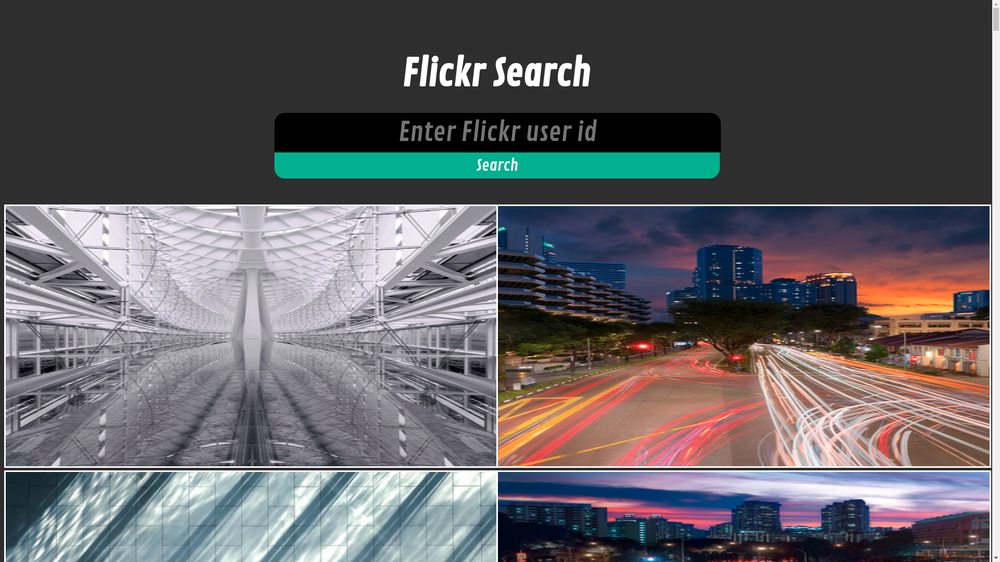

The purpose of this project was to practice using 3rd party API's and enviorment variables.

Visit this project live at: https://odin-flickr.herokuapp.com/

Visit https://www.webfx.com/tools/idgettr/ to get any flickr user's id.
Enter that ID into my flickr app to see the user's photos.

OR

Run the project locally (prerequisites: ruby 3.0.0, rails 6.0.3.1):

1. Download or clone the repository.
2. Open the terminal inside the root of the project and run:
3. bundle install
4. rails db:create
5. rails db:migrate
6. rails db:seed
7. make a flickr account: https://identity.flickr.com/sign-up
8. obtain an API key here: https://www.flickr.com/services/apps/create/apply/
9. run  bundle exec figaro install
10. open config/application.yml and add your API key to the file:

flickr_api_key: "YOUR_API_KEY_HERE"
flickr_secret: "YOUR_SECRET_HERE"

11. rails s
12. In your internet browser visit localhost:3000
13. Visit https://www.webfx.com/tools/idgettr/ to get any flickr user's id.
14. Enter that ID into my flickr app to see the user's photos.